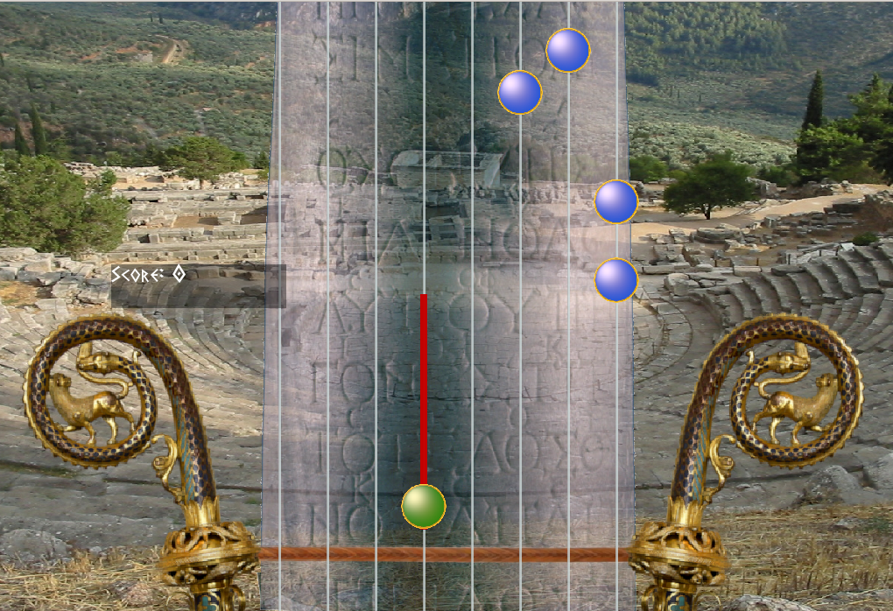

# Guitar Herald

A la 96 ème Olympiade de l'an -396, l'épreuve d'hérauts et de trompètes se déroule pour la première fois. Dans Guitar Herald, armez vous de votre Lyre 8 choeurs et revivez le frisson de cette épreuve mythique en interprétant des musiques cultes comme l'épitaphe de Sekilos. Il faudra jouer les notes en rythme, mais aussi les accords, les notes liées, et des ornements supplémentaires pour obtenir du score bonus. 

## Regles :

Une note non jouée retire 5 points de score, une note bien jouée ajoute 5 points. Si vous avez la maladresse de pincer une corde au mauvais moment, vous perdez 1 point. 

## Manuel d'installation : 

Sous linux, il suffit de tapper la commande `make` dans le dossier `./game/`. Si vous n'avez pas installé le moteur graphique SFML2, il faut tapper `sudo apt-get install libsfml-dev`. 
Pour lancer le jeu, lancer `sfml-app`.

## Réalisation technique :

### Synchro:

Dans un jeu de rythme, la synchronisation entre le jeu et la musique est essentielle. SFML met à notre disposition les Objets `Clock` et `Time`, qui permettent de rendre compte très précisément du temps OS écoulé entre deux évènements. Laisser tourner l'horloge pendant toute la durée d'une chanson n'est pas un problème : les objets `Time` sont un nombre de microsecondes stocké dans un `Int64`, ce qui fait en sorte que notre horloge ne subira pas d'overflow avant des milliers d'années !

Sources : 
 * https://commons.wikimedia.org/wiki/File:Ancient_Greek_theatre_at_Delphi,_Dlf474.jpg
 * https://www.worldhistory.org/uploads/images/3806.jpg?v=1599364805
 * https://en.wikipedia.org/wiki/Herald_and_Trumpet_contest
